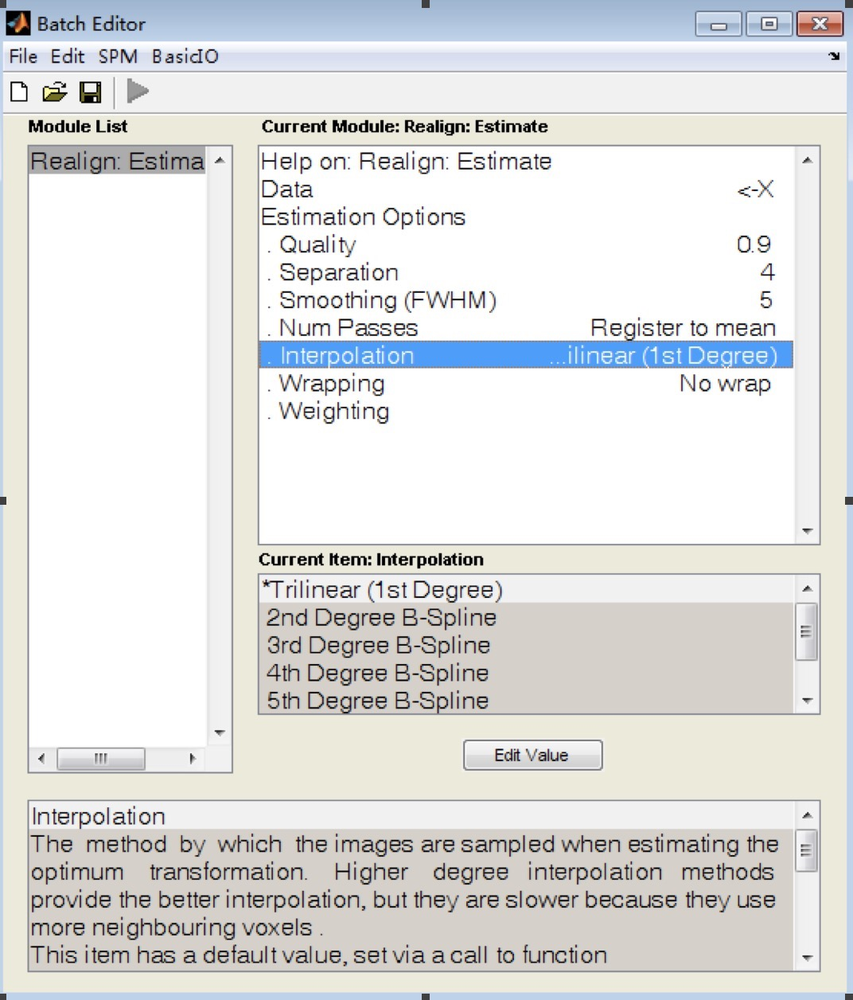
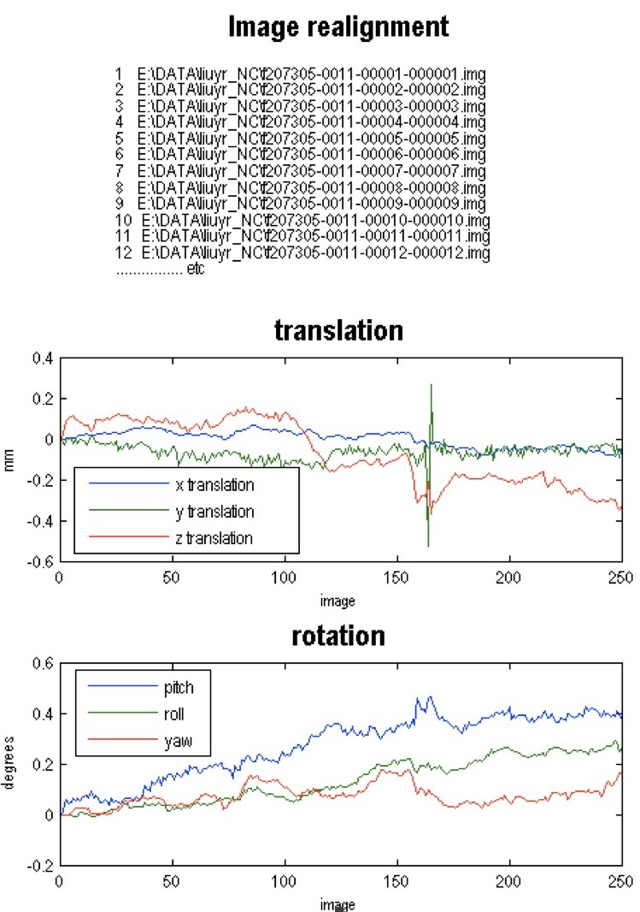
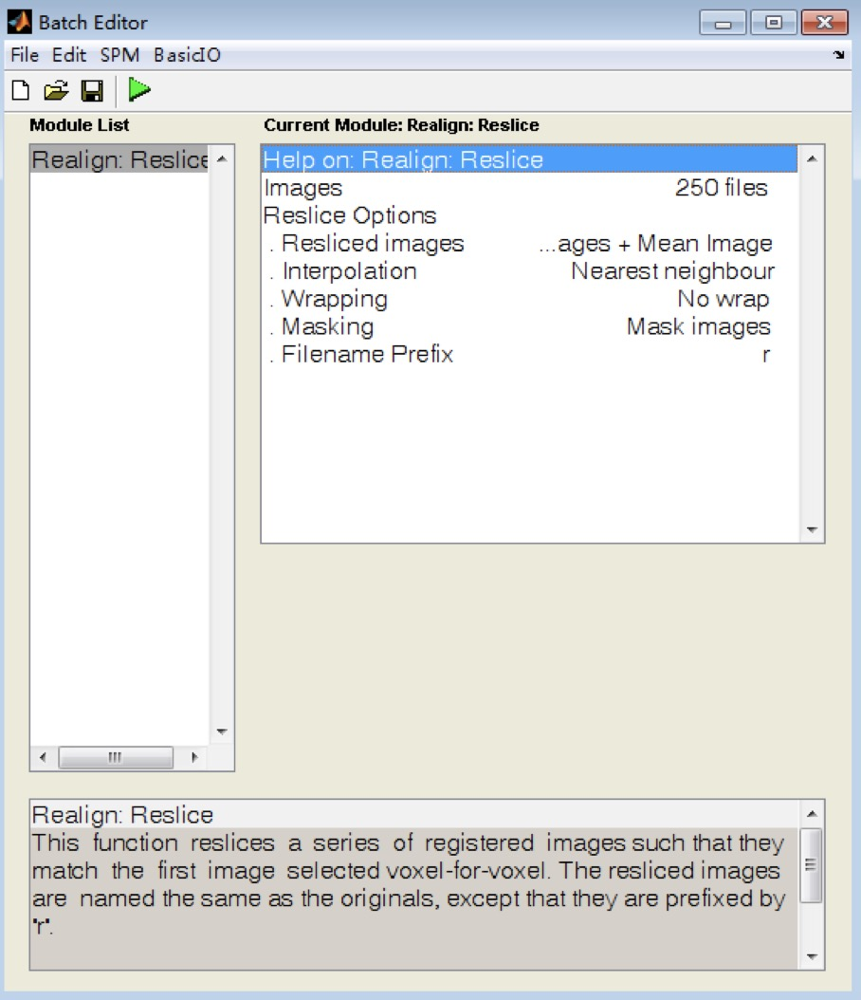

# Preprocessing Steps Applied to Raw fMRI

Preprocessing is implemented based on Statistical Parametric Mapping SPM8 on Matlab 2014b.

### Step 1. Slice Timing Correction

Check whether the slice timing of an image is correct. If yes, go to Step 2. If no, correct slice timing.

### Step 2. Realignment (Estimated)

Perform  realignment (estimated): Batch -&gt; SPM -&gt; Spatial -&gt; Realign: Estimated

Use the following settings: 

Interpolation: Trilinear

Other settings: default



The result looks like this:



Determine if the curves have spikes (as in the translation picture above). If yes, go back to adjust the position or size of the images and do the realignment again until there are no more spikes. If no, go to Step 3.

### Step 3. Realignment (Reslice)

Perform  realignment (reslice): Batch -&gt; SPM -&gt; Spatial -&gt; Realign: Reslice

Use the following settings: 

Interpolation: Nearest Neighbor

Other settings: default



This step generates output files with prefix *r* and mean image files.


### Step 4. Spatial Normalization

Perform  normalization (estimated &amp; write): Batch -&gt; SPM -&gt; Spatial -&gt; Normalise: Estimated &amp; Write

Use the following data and settings: 

Data:

 - Source Image: mean image generated in Step 3
 - Images to Write: time series fmri images generated in Step 3 (with prefix *r*)

Estimation Option: Template Image: spm8\templates\EPI.nii


Write Option:

 - Bounding Box = 
                  
                  -90 -126 -74
                   90   90 106


 - Voxel Size = 2 2 2
 - Interpolation: Trilinear

Other settings: default
 
 

This step generates files with prefix *w.* 


**Attention:** Always inspect the outputs in Steps 1 through 4 visually to ensure that the preprocessing measures have been applied successfully.

### Step 5. Averaging Over Regions

Average the intensities over regions according to the Automated Anatomical Labeling (AAL).

```mat
    roifile='C:\Program Files\MATLAB\spm8\toolbox\aal\ROI_MNI_V4.nii';
    list=load('C:\Program Files\MATLAB\spm8\toolbox\aal\ROI_MNI_V4_List.mat');
    menu1=ls('C:\data\bnu_data\NC\*_NC');
 
    [tmp rgnum]=size(list.ROI);
    e=zeros(250,rgnum,16);spm
    for u = 1:length(menu1);
 
    file=ls(strcat('C:\data\bnu_data\NC\',menu1(u,:),'\wrf*.img'));
 
    [fnum tmp] = size(file);
    img=spm_read_vols(spm_vol(roifile));
        for i=1:fnum
            disp(u*1000+i);
            s=strcat('C:\data\bnu_data\NC\',menu1(u,:),'\',file(i,:));
            s=spm_read_vols(spm_vol(s));
            for j=1:rgnum
                ind=find(img==list.ROI(1,j).ID);
                a=zeros(size(img));
                a(ind)=1;
                mate=a.*s;
                mate=mate(ind);
                e(i,j,u)=mean(mate);
            end
        end
    end
```

## Acknowledgements

The above procedure was devised and implemented by

* **[Zhang Min](mailto:chinazm@gmail.com)** Scientist at Mayo Clinic


