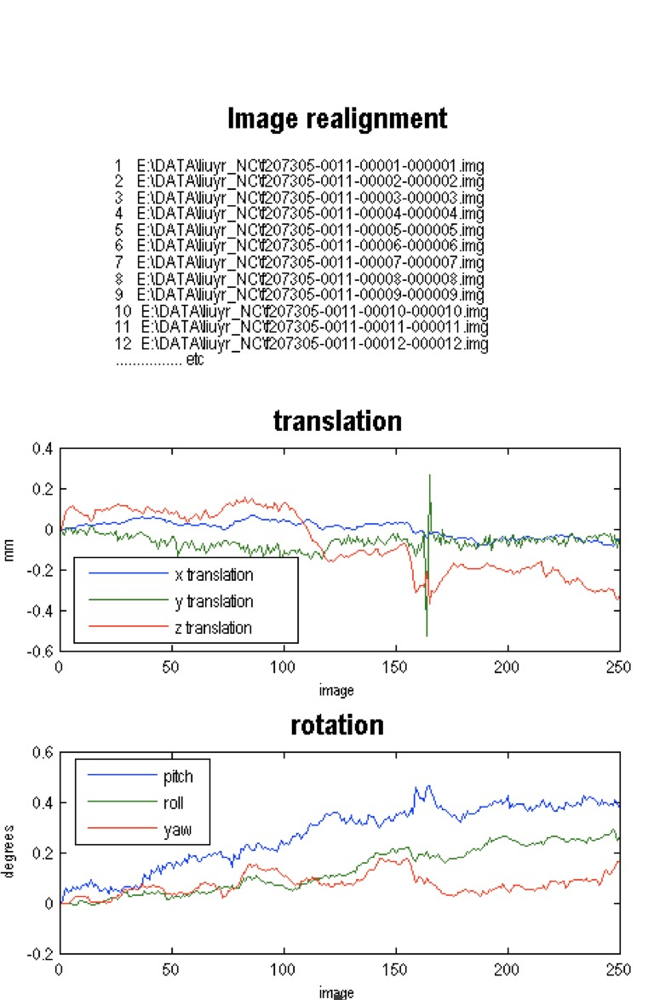

## Contact

* **[Zhang Min](mailto:chinazm@gmail.com)** (Mayo Clinic) - *Author of fMRI preprocessing implementation.*


# fMRI Processing Procedure

## Step 1. Check whether the images did Slice timing correction step or not.

If yes, go to step 2.

If not, do the slice timing step.

## Step 2. Realign (estimated)

Do the realign step:

Batch -&gt; SPM -&gt; Spatial -&gt; Realign(estimated):

Interpolation: Trilinear

Other settings: default


See the result below:




If there is a sharp change in the results, we should go back to adjust the 
position or size of the images and do the realign again.

## Step 3. Realign (reslice)

Do the realign (Reslice) step:

Batch -&gt; SPM -&gt; Spatial -&gt; Realign(Reslice):

Interpolation: Nearest Neighbor

Other settings: default


This step will generate r\* output files and mean image file


## Step 4.Spatial normalized

Do the normalize (Estimated &amp; Write) step:

Batch -&gt; SPM -&gt; Spatial -&gt; Normalize -&gt; (Estimated &amp; Write):

Data:

 - Source Image: Mean image generated by step 3.
 - Images to Write: time series fmri images generated by step 3 (r\*).

Estimation Option:
 - Template Image: spm8\templates\EPI.nii

Write Option:

 - Bounding Box = 
                  
                  -90 -126 -74
                   90   90 106


 - Voxel Size = 2 2 2
 - Interpolation: Trilinear

Other settings: default
 
 

After this step, the w\* files generated can be used for future analysis.

### Attention:

After each step, it is necessary to visually check some of the source images for quality control.

## Step 5 AAL

```mat
    roifile='C:\Program Files\MATLAB\spm8\toolbox\aal\ROI_MNI_V4.nii';
    list=load('C:\Program Files\MATLAB\spm8\toolbox\aal\ROI_MNI_V4_List.mat');
    menu1=ls('C:\data\bnu_data\NC\*_NC');
 
    [tmp rgnum]=size(list.ROI);
    e=zeros(250,rgnum,16);spm
    for u = 1:length(menu1);
 
    file=ls(strcat('C:\data\bnu_data\NC\',menu1(u,:),'\wrf*.img'));
 
    [fnum tmp] = size(file);
    img=spm_read_vols(spm_vol(roifile));
        for i=1:fnum
            disp(u*1000+i);
            s=strcat('C:\data\bnu_data\NC\',menu1(u,:),'\',file(i,:));
            s=spm_read_vols(spm_vol(s));
            for j=1:rgnum
                ind=find(img==list.ROI(1,j).ID);
                a=zeros(size(img));
                a(ind)=1;
                mate=a.*s;
                mate=mate(ind);
                e(i,j,u)=mean(mate);
            end
        end
    end
```

